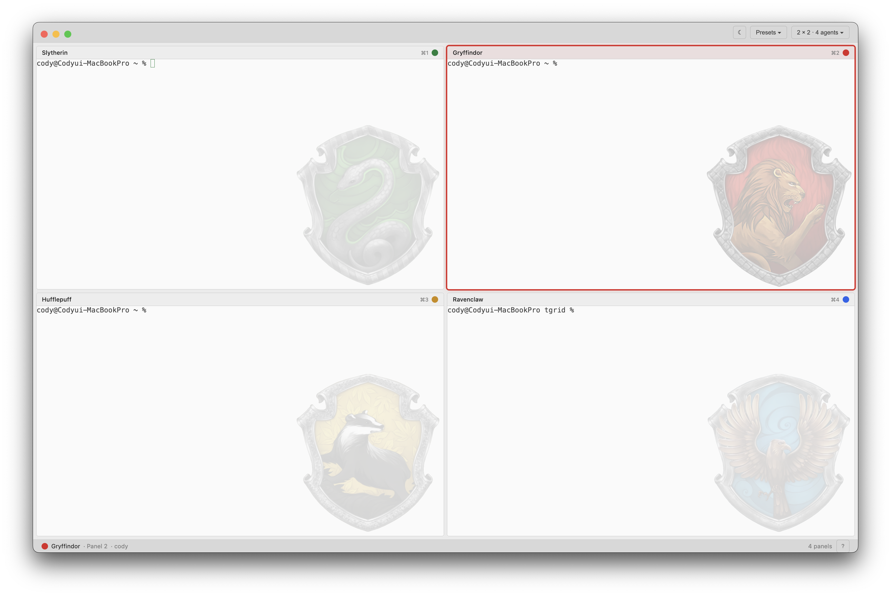
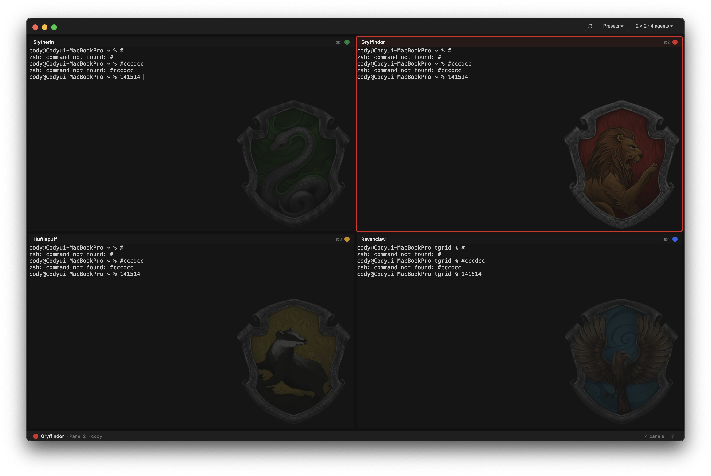
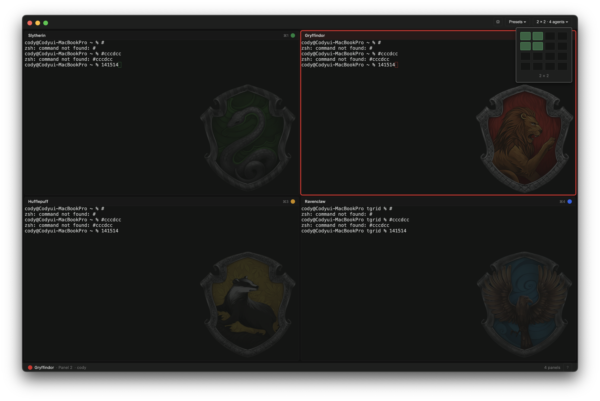
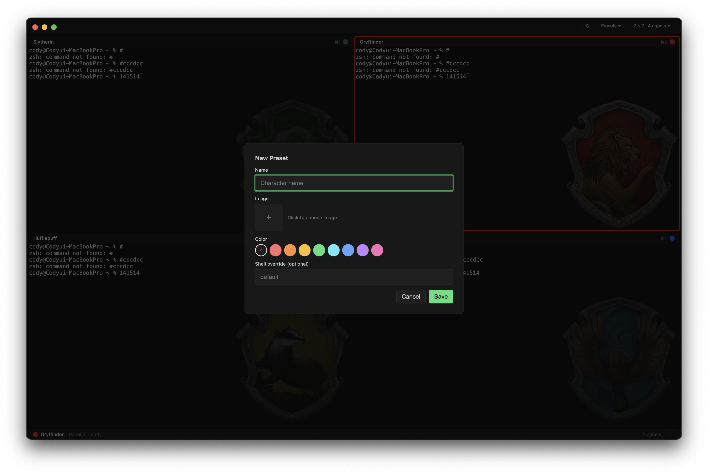

# tgrid

<p align="center">
  
</p>

AI 에이전트를 위한 **t**erminal **grid** 매니저 — 해리포터의 해그리드(Hagrid)에서 이름을 따왔습니다. 어린 마법사들을 새로운 세계로 이끄는 다정한 거인처럼, tgrid는 AI 에이전트들을 각자의 터미널로 안내합니다.

여러 터미널을 그리드 레이아웃으로 배치하고, 각 패널에 반투명 캐릭터 이미지를 오버레이할 수 있습니다.


[English](README.md)

## 스크린샷

| 라이트 테마 | 다크 테마 |
|:-:|:-:|
|  |  |

| 그리드 크기 변경 | 프리셋 편집기 |
|:-:|:-:|
|  |  |

## 기능

- **그리드 레이아웃** — 최대 4x4 (16개) 터미널을 동시에 배치
- **캐릭터 프리셋** — 패널별로 이름, 이미지, 색상, 셸을 지정
- **프리셋 팩** — 번들 프리셋 팩 (예: 해리포터 기숙사) UI에서 설치 가능
- **이미지 오버레이** — 터미널 위에 반투명 캐릭터 이미지 렌더링
- **세션 복원** — 종료 시 그리드 설정, 프리셋 할당, 작업 디렉토리를 저장하고 재실행 시 복원
- **드래그 앤 드롭** — 패널 헤더를 드래그하여 프리셋 할당을 교환
- **공간 그리드 리사이즈** — 실행 중 그리드 크기를 변경하며 패널의 행/열 위치를 유지
- **라이트/다크 테마** — 라이트/다크 테마 전환, OSC 10/11 컬러 리포팅으로 CLI 도구에 전파
- **CJK 입력** — 한국어, 일본어, 중국어 입력을 위한 완전한 UTF-8 로케일 지원

## 빠른 시작

```bash
# 의존성 설치
npm install

# 개발 모드
npm run dev

# 특정 그리드 크기로 실행
npm run dev -- 2 3   # 2행, 3열
```

## 키보드 단축키

| 단축키 | 동작 |
|---|---|
| `Cmd/Ctrl + 1-9` | 번호로 패널 포커스 |
| `Cmd/Ctrl + Arrow` | 패널 간 이동 |
| `Cmd/Ctrl + Enter` | 활성 패널 전체 화면 토글 |
| `Shift` (실행 시) | 세션 복원 건너뛰기, 새로 시작 |

## 설정

설정 파일은 `~/.tgrid/config.json`에 저장됩니다.

```json
{
  "defaultShell": "/bin/zsh",
  "defaultOpacity": 0.3,
  "activeOpacity": 0.5,
  "theme": "dark",
  "presets": [
    {
      "id": "claude",
      "name": "Claude",
      "image": "~/.tgrid/characters/claude.png",
      "color": "#a855f7",
      "shell": "/bin/zsh"
    }
  ],
  "assignments": {
    "0": "claude"
  }
}
```

| 필드 | 설명 |
|---|---|
| `defaultShell` | 기본 셸 경로 |
| `defaultOpacity` | 비활성 패널의 캐릭터 이미지 투명도 |
| `activeOpacity` | 활성 패널의 캐릭터 이미지 투명도 |
| `theme` | 컬러 테마 (`dark` 또는 `light`) |
| `presets` | 캐릭터 프리셋 목록 (이름, 이미지, 색상, 셸) |
| `assignments` | 패널 인덱스와 프리셋 ID 매핑 |

## 빌드

```bash
# 현재 플랫폼용 빌드 (Electron Forge)
npm run dist

# 플랫폼별 빌드
npm run dist:mac     # macOS
npm run dist:win     # Windows
npm run dist:linux   # Linux
```

릴리스 빌드 스크립트를 사용하면 더 세밀한 제어가 가능합니다:

```bash
./scripts/build.sh           # 현재 플랫폼용 빌드
./scripts/build.sh mac       # macOS (dmg + zip)
./scripts/build.sh win       # Windows (nsis + zip)
./scripts/build.sh linux     # Linux (AppImage + deb + tar.gz)
./scripts/build.sh all       # 전체 플랫폼 (크로스 컴파일 도구 필요)
```

## 프로젝트 구조

```
tgrid/
├── src/
│   ├── main/
│   │   ├── main.ts            # Electron 메인 프로세스 (IPC, 단축키, 세션)
│   │   ├── pty-manager.ts     # PTY 수명주기 관리 (node-pty)
│   │   ├── config.ts          # 설정/세션 파일 I/O
│   │   └── image-loader.ts    # 이미지 파일 로딩 및 파일 선택
│   ├── preload/
│   │   └── preload.ts         # Context-isolated IPC 브릿지
│   ├── renderer/
│   │   ├── index.tsx           # React 진입점
│   │   ├── App.tsx             # 앱 셸 (그리드 리사이즈, 스왑, IPC 이벤트)
│   │   ├── global.d.ts         # Window.tgrid 타입 선언
│   │   ├── components/
│   │   │   ├── Grid.tsx            # 안정적 DOM 순서의 그리드 컨테이너
│   │   │   ├── Panel.tsx           # 헤더, 터미널, 오버레이가 포함된 패널
│   │   │   ├── TerminalView.tsx    # xterm.js 터미널 래퍼
│   │   │   ├── AgentOverlay.tsx    # 캐릭터 이미지 오버레이
│   │   │   ├── GridPicker.tsx      # 초기 그리드 크기 선택기
│   │   │   ├── GridResizeDropdown.tsx
│   │   │   ├── PresetDropdown.tsx
│   │   │   └── PresetEditor.tsx
│   │   ├── context/
│   │   │   ├── GridContext.tsx          # 복합 Provider 및 훅
│   │   │   ├── GridLayoutContext.tsx    # 그리드 행/열 상태
│   │   │   ├── GridSelectionContext.tsx # 활성/전체화면 패널 상태
│   │   │   ├── PresetContext.tsx        # 프리셋, 할당, 설정 상태
│   │   │   └── ThemeContext.tsx         # 테마 상태
│   │   ├── hooks/
│   │   │   ├── useTerminal.ts      # xterm.js + PTY 바인딩 훅
│   │   │   ├── useIpc.ts           # IPC 이벤트 리스너 훅
│   │   │   ├── useImageLoader.ts   # 캐싱이 포함된 지연 이미지 로더
│   │   │   ├── useDragSwap.ts      # 드래그 앤 드롭 스왑 훅
│   │   │   └── useDropdownPosition.ts
│   │   ├── utils/
│   │   │   ├── colors.ts       # 색상 유틸리티
│   │   │   └── ptyMap.ts       # PTY ID 헬퍼
│   │   └── styles/
│   │       ├── index.css        # 메인 스타일
│   │       └── themes.css       # 라이트/다크 테마 변수
│   ├── shared/
│   │   └── types.ts            # 공유 IPC 타입 정의
│   └── __tests__/              # 24개 테스트 파일 (Vitest + Testing Library)
│       ├── setup.ts
│       ├── test-utils.tsx
│       ├── components/
│       ├── context/
│       ├── hooks/
│       ├── main/
│       └── utils/
├── resources/
│   ├── icon.svg                # 앱 아이콘 (SVG 소스)
│   ├── icon.png                # 앱 아이콘 (PNG)
│   ├── icon.icns               # 앱 아이콘 (macOS)
│   ├── icon.ico                # 앱 아이콘 (Windows)
│   └── presets/                # 번들 프리셋 팩
│       └── harry-potter/       # 해리포터 기숙사 문장 (CC BY-SA 2.0)
├── scripts/
│   ├── dev.mjs                 # 개발 서버 스크립트
│   └── build.sh                # 릴리스 빌드 스크립트
├── forge.config.ts             # Electron Forge 설정
├── vite.main.config.ts
├── vite.preload.config.ts
├── vite.renderer.config.ts
├── vitest.config.mts
└── tsconfig.json
```

## 기술 스택

- **Electron 41** — 데스크톱 애플리케이션 프레임워크
- **React 19** — UI 프레임워크
- **TypeScript 5.5** — 타입 안전한 개발
- **Vite 5** — 빌드 도구 (Electron Forge 7 경유)
- **node-pty 1** — 네이티브 PTY (의사 터미널) 바인딩
- **xterm.js 6** — 터미널 에뮬레이터 (xterm-256color, OSC 10/11 컬러 리포팅)
- **Vitest 2** — 유닛 테스트 프레임워크
- **Testing Library** — React 컴포넌트 테스트 (16+ react, 6+ jest-dom)

## 테스트

컴포넌트, 컨텍스트, 훅, 메인 프로세스 모듈, 유틸리티를 다루는 24개의 테스트 파일.

```bash
npm test            # 테스트 한 번 실행
npm run test:watch  # 감시 모드
```

## 라이선스

MIT

서드파티 에셋 라이선스는 [THIRD_PARTY_NOTICES.md](THIRD_PARTY_NOTICES.md)를 참조하세요.
